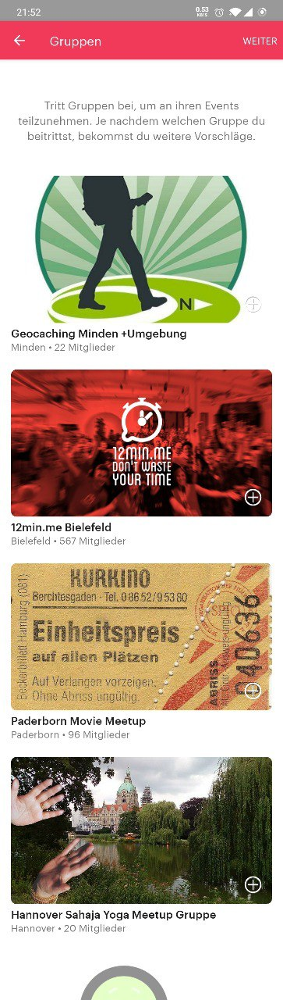

# State of tech

There are many different mobile applications available which primarily focus on finding nearby events. Some care about social events and interacting with new people with the same interest, so they let every user create them. An example would be [Meetup](https://play.google.com/store/apps/details?id=com.meetup) where one can find events about i.e. cooking or cycling.
Then there are some that only accept events with an entrance fee like bigger parties. [The Move](https://play.google.com/store/apps/details?id=com.themove) for example concentrates on purchasing tickets and scanning them. [Party Hunt: Goa](https://play.google.com/store/apps/details?id=com.samsara.partyhunt) even has different views to explore parties: a poster wall and a map view. You can save money through an in-app discount as well.
The next division of apps are those, which clearly differentiate between normal users and organizers. They care about official events. For that reason [Eventbrite](https://play.google.com/store/apps/details?id=com.eventbrite.attendee) has a second application only for organizers.
Furthermore, applications like [Ticketmaster](https://play.google.com/store/apps/details?id=com.ticketmaster.tickets.international) specialize on events like shows and live performances.

So these apps have...

* events / parties / shows listed in a list or on a map view
* event, organizer and attendees information
* the option to purchase tickets (also with discounts)
* social interactions
  * rate
  * comment
  * follow friends, organizers, topics, groups, artists
  * share
* recommendations
* the option to search and filter
* the option to create events
  * as a user
  * as an organizer
* the ability to simplify the entrance and get statistics
* many more features ...

But the aforementioned applications may suffer from dead servers, geographical limitations or too many / less features.

## Example pictures

### Party Hunt: Goa

1: List view

2: Map view

3: Poster view

4: Event view

5: Create event view

### Meetup

1: Categories view

2: Group view